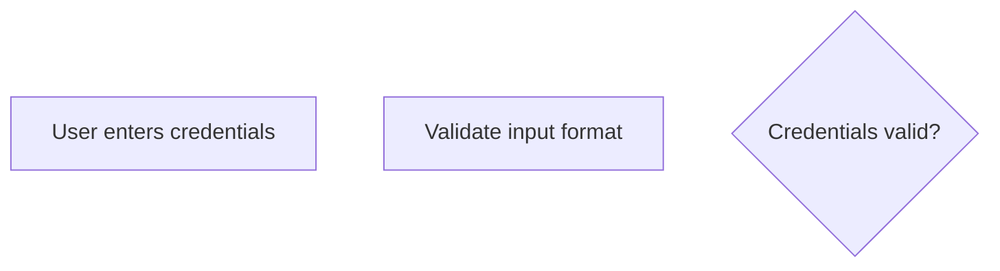

# Mermaid Diagrams Skill

This skill helps create clean, well-organized Mermaid diagrams for software engineering and architecture visualization.

<when_to_use>
Use this skill specifically for creating, editing, fixing, or improving Mermaid diagrams:
- **Create** new Mermaid diagrams
- **Edit** existing Mermaid diagrams
- **Fix** broken or incorrect diagram syntax
- **Improve** diagram organization or readability
- **Visualize** software architecture or technical concepts

For simply reading or interpreting existing diagrams, proceed directly without this skill.
</when_to_use>

<diagram_types>

This skill supports all major Mermaid diagram types for software engineering:

1. **Flowcharts** - Process flows, algorithms, decision trees
2. **Sequence Diagrams** - API interactions, service communication, workflows
3. **Class Diagrams** - Object models, domain design, relationships
4. **ER Diagrams** - Database schemas, data models
5. **State Diagrams** - State machines, workflow states, lifecycle
6. **C4 Diagrams** - Software architecture (context, container, component)
7. **Git Graphs** - Branching strategies, version control workflows
</diagram_types>

<references>
Before writing or fixing a diagram, read `references/gotchas.md` (common errors, special characters, reserved keywords) and the syntax reference for its type:

- `references/syntax-flowchart.md`
- `references/syntax-sequence.md`
- `references/syntax-class.md`
- `references/syntax-er.md`
- `references/syntax-state.md`
- `references/syntax-c4.md`
- `references/syntax-git.md`

Read on demand:

- `references/styling.md` - themes and colors, when the user asks for a look or the diagram needs emphasized elements
- `references/patterns.md` - architecture patterns (microservices, hexagonal, CQRS, etc.), when the diagram shows a system design
</references>

<templates>

Pre-built, well-commented templates are available in `assets/templates/`:

- `flowchart-template.md` - Organized flowchart with sections
- `sequence-template.md` - Sequence diagram with best practices
- `class-template.md` - Domain model class diagram
- `er-template.md` - Database schema ER diagram

**Use templates when:**
- Starting a new complex diagram
- User wants a well-organized structure
- Creating diagrams that will grow over time
</templates>

<best_practices>

### 1. Clean Code Organization

Use the same principles as code:
- **Comment liberally** - Use `%%` to explain sections
- **Group related items** - Keep related nodes/classes together
- **Separate concerns** - Define structure first, styling last
- **Use descriptive names** - Make IDs and labels meaningful

**Example:**


### 2. Make Diagrams Navigable

For large diagrams:
- Use clear section headers in comments
- Group logically related elements
- Keep consistent indentation in the code
- Add blank lines between sections

**Structure pattern:**
```
%% Section 1: Definition
[define elements]

%% Section 2: Connections
[define relationships]

%% Section 3: Styling
[define styles]
```

### 3. Handle Complexity

When diagrams get large:
- Break into multiple smaller diagrams
- Use subgraphs for logical grouping
- Link between diagrams with notes
- Consider creating an overview diagram

### 4. Avoid Common Pitfalls

Before finalizing any diagram, check:
- [ ] No reserved keywords as node IDs
- [ ] Special characters properly escaped or quoted
- [ ] All brackets/parens balanced
- [ ] All blocks (subgraph, loop, alt) properly closed
- [ ] Unique IDs for all elements
- [ ] Consistent quote style throughout
</best_practices>

<syntax_reference>

### Escaping Special Characters
```mermaid
%% Use quotes for special characters
A["Function with (parentheses)"]
B["Text with [brackets]"]

%% Or use HTML entities
C[getData#40;#41;]  %% getData()
```

### Common Relationship Patterns

**Flowcharts:**
- `-->` solid arrow
- `-.->` dotted arrow
- `==>` thick arrow

**Class diagrams:**
- `<|--` inheritance
- `*--` composition
- `o--` aggregation
- `-->` association
- `..>` dependency

**ER diagrams:**
- `||--||` one-to-one
- `||--o{` one-to-many
- `}o--o{` many-to-many
</syntax_reference>

<troubleshooting>

### Diagram Won't Render

1. Check for unbalanced quotes or brackets
2. Look for reserved keywords as IDs
3. Verify all blocks are closed (end statements)
4. Check for special characters - escape them
5. Ensure proper syntax for diagram type

### Common Error Fixes

**"Parse error"**
→ Check syntax matches diagram type

**"Syntax error in text"**
→ Escape special characters or use quotes

**Blank output**
→ Check browser console, usually invalid syntax

**Wrong appearance**
→ Verify correct diagram type declaration
</troubleshooting>

<editing_tips>

When editing existing diagrams:
1. Preserve the original structure and organization
2. Keep existing comments - they're valuable context
3. Maintain consistent naming conventions
4. Don't break working syntax to "improve" it
5. Test after each major change

When creating new diagrams:
1. Start with a template if appropriate
2. Build incrementally - test as you go
3. Add comments explaining the purpose
4. Use semantic styling (not just decoration)
5. Consider maintainability
</editing_tips>

<summary>

- **Start simple** - Add complexity incrementally
- **Comment well** - Future you will thank you
- **Test often** - Verify syntax as you build
- **Use templates** - Don't reinvent the wheel
- **Consult gotchas** - Avoid common errors
- **Stay organized** - Group and section your diagrams
</summary>
