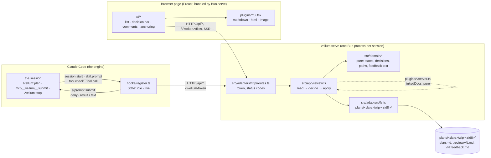
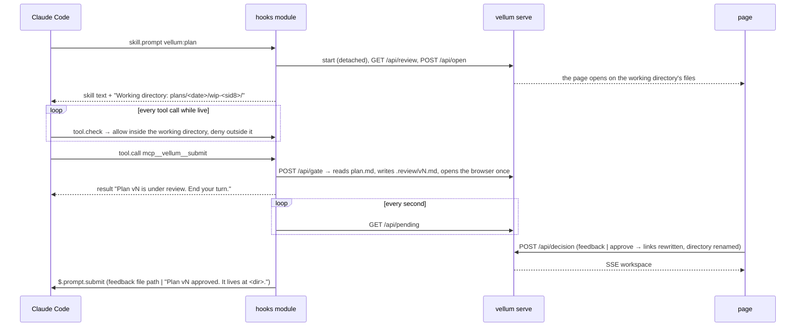
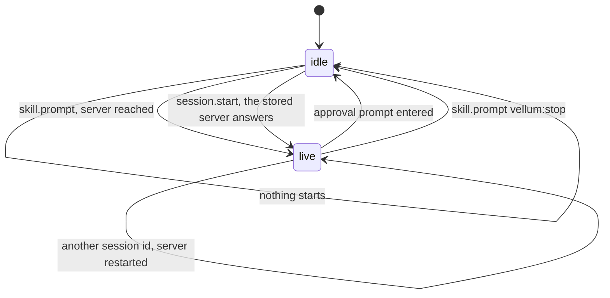
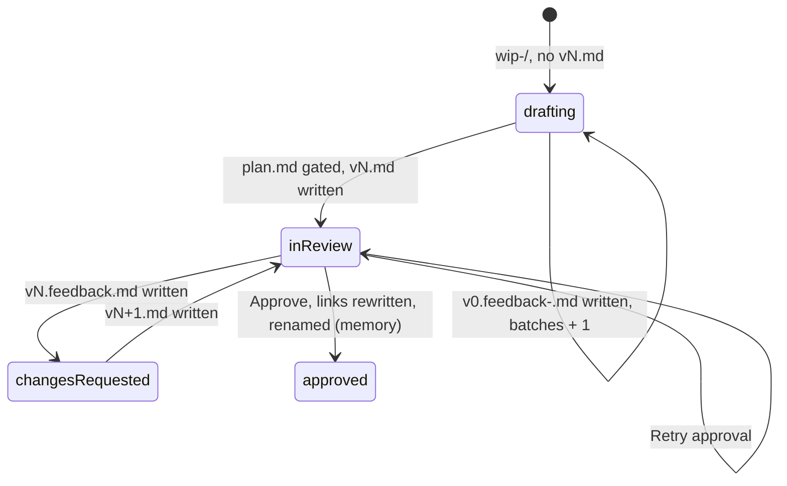

# Vellum: the map, and where it goes next

For the people who change the tree. The rules an agent holds to are in
[`.claude/rules/`](../.claude/rules/), one file per zone (hooks, server, page, tests); this
file draws what those texts describe, names the shape, says what moved to reach it, and
where phases 2 and 3 land in it.

## Three runtimes, one contract



`src/protocol.ts` is the one contract the three share: every value that crosses HTTP or a
plugin boundary is typed there and is JSON.

## What kind of architecture this is

**Hexagonal with a functional core**: two hexagons and one page, with the renderers as
feature slices. Ports and adapters give the direction (everything points at the domain,
the domain does no IO); "functional core, imperative shell" gives the weight (the domain
is functions over immutable data, one application module orchestrates, the adapters are
plain modules with no interface and no injection).

| Part | Shape | Driving side | Driven side |
|---|---|---|---|
| Hooks module | ports and adapters, one file | the engine's events (`session.start`, `skill.prompt`, `tool.check`, `tool.call`) | the engine's `$` (clock, store, http, process, prompt, tool), faked in tests |
| Server | ports and adapters, domain / app / adapters | `adapters/http/routes.ts` | the file system through `adapters/fs.ts`, real in tests (a temp directory) |
| Page | a store of signals and components | the reviewer's clicks | `/api`, the files route, SSE |
| `plugins/<kind>/` | feature slices: one document kind = one folder with its server half and its UI half | | |

Four levels of ceremony exist for the same principle; this is the lightest. The next one
up, ports as interfaces with a fake each and a contract test per port, is one hour away
the day a second file-system adapter exists: extract the port from `adapters/fs.ts`, hand
it to `app/review.ts`. The ones above (a use case object per intention, then aggregates
and repositories) answer needs this plugin does not have.

What moved to reach this shape, and why:

1. `src/workspace/` (pure parsing next to `readdir` and `rename`) split into
   `src/domain/` (paths, slug, links, the workspace state from a listing) and
   `src/adapters/fs.ts` (the listing, the reads and writes, the rename).
2. `src/server/review.ts` lost its `Bun.file` and `Bun.write` calls to the adapter and became
   `src/app/review.ts`: read, decide, apply, in one screen.
3. `src/protocol.ts` re-exports the domain types it carries (`PlanWorkspace`, `Pending`,
   `Decision`, `Anchor`, `Annotation`) instead of defining them; the page depends on the
   contract, the server on the domain.
4. `ui/state.ts` split into `ui/api.ts` (token, routes, SSE) and the store.
5. `src/boundaries.test.ts` holds the direction: an import that fails it is in the wrong
   layer, not a test to loosen.

Phases 2 and 3 add domain concepts (element anchors, drafting feedback, diffs, direct
edits, approval notes, drafts); each has an address in `src/domain/` before its first line.

## A review round



## The two state machines

The hooks module, in memory, one union:



`live` allows the file tools inside the working directory and denies them outside it, serves
`mcp__vellum__submit`, and polls `GET /api/pending` once a second until it closes: drafting
batches, then the review's decision, each relayed as a prompt.

The server, derived from the directory plus a memory overlay (`src/domain/workspace.ts`, `workspaceOf`):



What the hooks module must relay is read off that state (`pendingOf`): `drafting` with
batches means the drafting files to name, `changesRequested` a feedback file, `approved` the
final directory, anything else nothing. No second variable. The module keeps one number of
its own, in `$.store`: how many batches it already named, so a reload never repeats one.

## Where phases 2 and 3 land

| Feature | Pure part | Adapter part | Page part |
|---|---|---|---|
| Comment on an HTML element (#105) | an `Anchor` variant `element` and its line in the feedback text | a script injected into `text/html` responses, `postMessage` across the sandbox | the HTML renderer listens |
| Diff `vN-1` / `vN` (#106) | a line diff over two texts | `/api/review` returns the previous text | a toggle |
| Direct edit (#106) | the edited text is the version to finalize | a field on the decision or on finalize | an editor |
| Approval notes (#106) | `vN.notes.md` naming, the note in the prompt or the consent | | a textarea on Approve |
| Drafts (#106) | | `draft.json` read and written | restore on load |

Six of seven add a pure part first; `src/domain/` is where it goes.

## The tree

```
vellum/
  hooks/register.ts            the engine adapter, one file (the contract wants it self-contained)
  skills/plan/, skills/stop/   the way in and the way out, both `vellum:`-namespaced
  src/
    domain/                    pure, no IO, no Bun, no node:*
      paths.ts                 brands and parsers
      slug.ts, links.ts
      workspace.ts             PlanWorkspace from a listing, Memory, Pending, workspaceOf, pendingOf
      review.ts                Decision, gateVersion, decideOn, slugFor
      feedback.ts              Anchor, Annotation, FeedbackHeading, formatFeedback
    app/
      review.ts                the use case: read the directory, decide, apply
    adapters/
      fs.ts                    the listings, the reads and writes, the rename and rewrite
      http/routes.ts, http/serve.ts
      browser.ts               open the page
    protocol.ts                the JSON contract; re-exports the domain types it carries
    cli.ts                     the entry point: start | serve
    boundaries.test.ts         the dependency direction
  ui/
    api.ts                     the client: token, routes, SSE
    state.ts, app.tsx, …       the store and the components
    tools.tsx                  the controls row over the document: Select|Pinpoint, Beside the plan
    anchoring.ts, highlights.ts
  plugins/<kind>/{server.ts,ui.tsx}   one folder per document kind
  plugins/markdown/tree.ts            Markdown to hast, every element with its source lines
  plugins/markdown/pinpoint.ts        the target under the pointer: pure choice, thin DOM adapter
  plugins/index.ts, plugins/server.ts two registries: one bundle is a browser's
```

A test of `domain/` is a plain call; a test of `app/` uses a temp directory through the real
adapter (no fake: the file system is fast and honest); a test of `adapters/http` starts the
server on port 0.

Two other shapes were weighed and left:

- **Folders by kind of code, the IO moved out** (the tree before this one, with a
  `server/fs.ts`). Cheaper by an hour; leaves the domain types in the HTTP contract and the
  next feature asking where its pure part goes.
- **Vertical slices by feature** (`gate/`, `decision/`, `finalize/`, `docs/`). Wrong here:
  the features share one state machine and one directory layout; slicing them splits the
  union across folders, and the first review's bugs were exactly cross-feature state.

Also weighed and left, for now:

- File and function length thresholds: the pedantic oxlint and the anti-slop pack are the
  mechanical backstop.
- Ports as interfaces with a fake each: `adapters/fs.ts` has one implementation and the file
  system is fast; the port is extracted the day a second one exists.
- A contract test between the fake `$` and the engine: `claude plugin test` runs in the
  engine's environment, and `bun test` at the repository root fails on its import.
