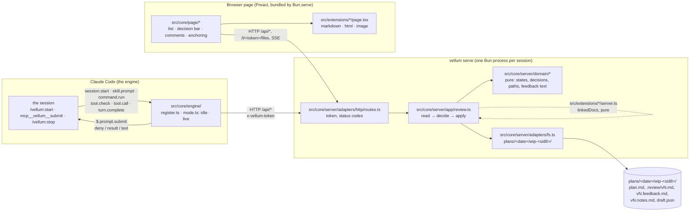
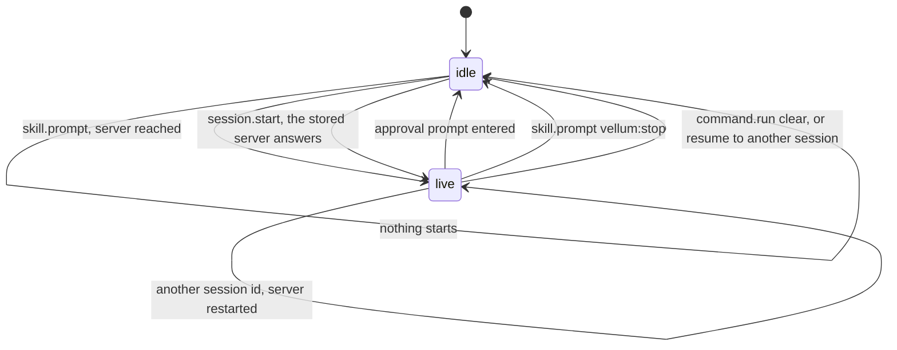
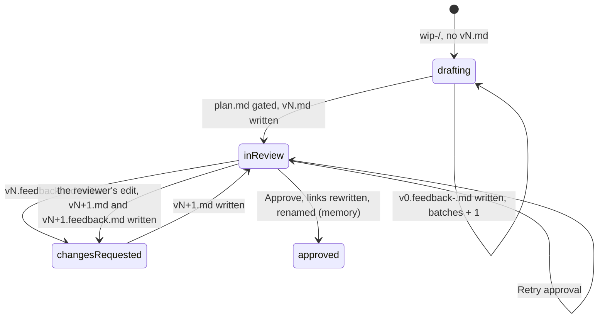

# Vellum: the map, and where it goes next

For the people who change the tree. The rules an agent holds to are in
[`.claude/rules/`](../.claude/rules/), one file per zone (engine, server, page, extensions, tests); this
file draws what those texts describe, names the shape, says what moved to reach it, and
where phases 2 and 3 landed in it.

## Three runtimes, one contract



`src/core/protocol.ts` is the one contract the three share: every value that crosses HTTP or
an extension boundary is typed there and is JSON. What an extension hands the core is typed
beside it, in `src/core/extension.ts`: § Extensions.

## What kind of architecture this is

**Hexagonal with a functional core**: two hexagons and one page, with the renderers as
feature slices. Ports and adapters give the direction (everything points at the domain,
the domain does no IO); "functional core, imperative shell" gives the weight (the domain
is functions over immutable data, one application module orchestrates, the adapters are
plain modules with no interface and no injection).

| Part | Shape | Driving side | Driven side |
|---|---|---|---|
| Hooks module | ports and adapters, `Host` the port | the engine's events (`session.start`, `skill.prompt`, `command.run`, `tool.check`, `tool.call`, `turn.complete`) | the engine's `$` (clock, store, http, process, prompt, tool), answered by the kit in tests |
| Server | ports and adapters, domain / app / adapters | `adapters/http/routes.ts` | the file system through `adapters/fs.ts`, real in tests (a temp directory) |
| Page | a store of signals and components | the reviewer's clicks | `/api`, the files route, SSE |
| `src/extensions/<id>/` | feature slices: one extension = one folder, a half per runtime it plugs into; today one per document kind | | |

Four levels of ceremony exist for the same principle; this is the lightest. The next one
up, ports as interfaces with a fake each and a contract test per port, is one hour away
the day a second file-system adapter exists: extract the port from `adapters/fs.ts`, hand
it to `app/review.ts`. The ones above (a use case object per intention, then aggregates
and repositories) answer needs this plugin does not have.

What moved to reach this shape, and why:

1. `src/workspace/` (pure parsing next to `readdir` and `rename`) split into
   `domain/` (paths, slug, links, the workspace state from a listing) and
   `adapters/fs.ts` (the listing, the reads and writes, the rename).
2. `src/server/review.ts` lost its `Bun.file` and `Bun.write` calls to the adapter and became
   `app/review.ts`: read, decide, apply, in one screen.
3. `protocol.ts` re-exports the domain types it carries (`PlanWorkspace`, `Pending`,
   `Decision`, `Anchor`, `Annotation`) instead of defining them; the page depends on the
   contract, the server on the domain.
4. The page's `state.ts` split into `api.ts` (token, routes, SSE) and the store.
5. `src/boundaries.spec.ts` holds the direction: an import that fails it is in the wrong
   layer, not a test to loosen.

Phases 2 and 3 added domain concepts (element anchors, drafting feedback, marks, the line
diff, the reviewer's edit, approval notes, drafts); each got its address in `domain/` before
its first line.

## A review round

```mermaid
sequenceDiagram
  participant CC as Claude Code
  participant M as hooks module
  participant S as vellum serve
  participant B as page
  CC->>M: skill.prompt vellum:start
  M->>S: start (detached), GET /api/review, POST /api/open
  S-->>B: the page opens on the working directory's files
  M-->>CC: skill text + "Working directory: plans/<date>/wip-<sid8>/"
  loop every tool call while live
    CC->>M: tool.check → allow inside the working directory, deny outside it
  end
  CC->>M: turn.complete (the main loop answered), or tool.call mcp__vellum__submit
  M->>S: POST /api/gate → reads plan.md, writes .review/vN.md, opens the browser once; an unchanged text is kept
  M-->>CC: status "plan vN under review" (and the tool's result: "End your turn.")
  loop every second
    M->>S: GET /api/pending
  end
  B->>S: PUT /api/draft (the unsent comments and edit, at every change)
  B->>S: POST /api/decision (feedback | approve, with the reviewer's edit or none)
  S->>S: an edit is vN+1: plan.md, then .review/vN+1.md; approve → notes file, links rewritten, directory renamed
  S-->>B: SSE workspace
  M->>CC: $.prompt.submit (feedback file path | "Plan vN approved. Read <notes file> first. It lives at <dir>.")
```

## The two state machines

The hooks module, in memory, one union:



`live` allows the file tools inside the working directory and denies them under the project
outside it, serves
`mcp__vellum__submit`, and polls `GET /api/pending` once a second until it closes: drafting
batches, then the review's decision, each relayed as a prompt.

The server, derived from the directory plus a memory overlay
(`src/core/server/domain/workspace.ts`, `workspaceOf`):



A version has an author: Claude through `gate`, or the reviewer, whose edit a decision records as
`vN+1` before it applies to it. The edit names the version it was made on, and `decideOn` refuses
one made on another. No state was added for it: `vN+1.md` with its feedback file reads as
`changesRequested`, like any other.

What the hooks module must relay is read off that state (`pendingOf`): `drafting` with
batches means the drafting files to name, `changesRequested` a feedback file, `approved` the
final directory and the notes file when its listing holds one, anything else nothing. No second variable. The module keeps one number of
its own, in `$.store`: how many batches it already named, so a reload never repeats one.

## Where phases 2 and 3 landed

| Feature | Pure part | Adapter part | Page part |
|---|---|---|---|
| Comment on an HTML element (#105) | `ElementRef`, the `Anchor` variant `element` and its line in the feedback text; `extensions/html/pick.ts` and `page/selection.ts` | `frame.js` built once at `startServer` and injected into `text/html` responses, `postMessage` across the sandbox | the HTML renderer bridges the frame and opens the Composer over the iframe |
| Coloured code and Mermaid (#105) | `rehype-highlight` in the `toTree` pipeline, so the hast keeps `data-lines`; the target kind `diagram` and `diagramPassage` in `extensions/markdown/pinpoint.ts` | | the Markdown renderer turns a `mermaid` block into a `figure`, draws it after the mount, and boxes it where text is highlighted |
| Diff `vN-1` / `vN` (#106) | `domain/diff.ts`: `lineDiff` over the `diff` package, `countChanges`; `extensions/markdown/changes.ts`: which block carries a mark, where a removed run goes | `/api/review` returns the previous version's text | `planChanges` computed once; the count beside the version, the "Changes since" toggle, the marks and the text-free removed blocks in the Markdown renderer |
| Delete marks and quick labels (#106) | `Mark` on `Annotation`, `QUICK_LABELS` with the sentence Claude reads, in `domain/feedback.ts` | `parseMark` in the boundary block of `routes.ts` | the Composer's label row and "Delete this", the card's chip and struck quote |
| Direct edit (#106) | `Edit`, `decideOn` (the edit is `vN+1`, refused on another version), `editOnLoad`, `landedAnnotations` in `domain/review.ts`; `shiftLines`, `shiftAnnotations` in `domain/diff.ts` | `parseEdit`; `Review.decide` writes `plan.md`, then the version file | `page/editor.tsx` and `page/caret.ts`; `edited`, `editing`, `finishEdit`, `settleEdit` in `state.ts` |
| Approval notes (#106) | `formatNotes`, `notesFile`, `approved.notes` read off the final directory's listing, `Pending.approved.notes` | the notes file written before the rename; `engine/relay.ts` names it in the approval's prompt | the decision bar's one popover state: notes, and the warning before unsent comments are discarded |
| Drafts (#106) | `Draft`, `DRAFT_FILE`, `takesComments` | `GET` and `PUT /api/draft`, stored and never read back; removed by a decision that lands | `start`: restore, load, then save at every change, in order |

Every one added a pure part first; `src/core/server/domain/` is where a new domain concept
goes, and a renderer's own choice stays beside its `page.tsx`.

## Extensions

`markdown`, `html` and `image` are extensions, and so is whatever comes next (`grill`, then
`advisor`): a folder under `src/extensions/`, with one file per place where it plugs into the
core. The contract's client is the next agent that writes one, not a third party; the engine
constraints below are why.

```ts
// src/core/extension.ts
export type Renderer = { accepts: (doc: DocRef) => boolean; component: ComponentType<RendererProps> };

export type PageExtension = { readonly id: string; readonly renderers?: readonly Renderer[] };
export type ServerExtension = {
  readonly id: string;
  readonly linkedDocs?: (plan: string, roots: LinkRoots) => readonly DocLink[];
};

// src/extensions/page.ts
export const pageExtensions: readonly PageExtension[] = [markdownPage, htmlPage, imagePage];
// src/extensions/server.ts
export const serverExtensions: readonly ServerExtension[] = [markdownServer];
```

| Half | File | Declares | Reached from |
|---|---|---|---|
| page | `<id>/page.tsx` | a `PageExtension`: its renderers, tried in registry order | `core/page/app.tsx`, through `extensions/page.ts` |
| server | `<id>/server.ts` | a `ServerExtension`: `linkedDocs`, pure, candidates in and links out | `core/server/adapters/http/serve.ts`, through `extensions/server.ts` |
| engine | `<id>/engine.ts` | lands with `grill` | `core/engine/register.ts` |

`src/boundaries.spec.ts` holds the layout: an extension imports `core/` and its own folder,
never another extension; the core reaches the extensions from those two files alone; from
`core/page/` an extension imports the files of `PAGE_SURFACE`, the list found when the rule was
written, and no other; every folder holds a half, a half's `id` is its folder's name, and its
registry names it. One exception is left, marked TODO in `serve.ts`: the server builds
`extensions/html/frame.ts` by its path, because a server half cannot hand the core a script
yet.

### What the engine allows

Measured on a copy of this tree while the layout was planned (`research.md` in the plan
directory named below), except where the line says docs.

- `hooks/hooks.json` must stay where it is; its `modules` entry may name
  `../src/core/engine/register.ts`. `claude plugin validate` lists the same hooks,
  `claude plugin test` runs the kit's tests and their fixtures from beside the module, and a
  session under `--plugin-dir` loads it and spawns the server from `src/core/server/cli.ts`.
  Not measured: the copy an install puts in the cache.
- One hooks module per plugin: a second `modules` entry is refused ("`modules` names one hooks
  module per plugin"). An extension cannot bring a module of its own.
- One hook per event: two `on("turn.complete")` without a matcher keep the module from loading
  ("is registered twice without a matcher"). An extension cannot register a hook of its own.
- What passes `validate` and runs under the kit: one hook per event in `register.ts`, calling
  handlers imported by value from `../../extensions/<id>/engine.ts`, each handed a `Host`. So
  the core owns every engine event and hands it to the extensions. The engine rule of
  `boundaries.spec.ts` allows siblings alone today; the first `engine.ts` widens it.
- Docs: a module path that leaves the plugin is refused (`path-traversal`), and `$` is not
  passed as a value out of the file that registers the hook. So the module cannot load hook
  code from the user's repository: no third party ever has an engine half, hence no dynamic
  loading and no versioned API.
- Docs: skills and agents load with the plugin, so a Vellum config cannot hide one per
  repository; the module can only refuse it at `skill.prompt`. `userConfig` values live in the
  user's settings and project entries are ignored, so a per-repository config is a file of
  Vellum's own.

### Config: lands with grill

Nothing below exists yet. An option or a flag is added when someone asks to turn it, and
`grill` is the first to ask: its `enabled` changes the skills and the context the agent gets,
which goes through an engine half no extension has today. Designed from the renderers alone,
the types would be guesses. The approved design is `extension-contract.md` in
`plans/2026-09-17/extensions-de-vellum-arbre-noms-et-garde-fous/`; in short:

- A fourth file, `<id>/manifest.ts`: `id`, `required`, and the options as data (`boolean`,
  `number`, `text`, `choice`, each with its default). Pure, and the one file all three runtimes
  import. `definePage` and `defineServer` hand a half its options already typed; an extension
  writes no validation.
- Three layers, merged key by key, the last one winning: `~/.claude/vellum.json`,
  `.claude/vellum.json` (committed), `.claude/vellum.local.json` (git-ignored). With no file,
  every default applies. `enabled` is the core's key, never an option.
- `resolveConfig(manifests, layers)` refuses, naming the file, the key and what it expected:
  an unknown extension or option, a wrong kind, a number out of bounds, a choice outside its
  list, `enabled: false` on a required extension. The server reads the files when it starts
  and refuses to start on an error; the page and the engine get the resolved config from the
  server, and nothing else reads the files.

The crossroads a feature edits today, and the place `grill` has to open for each:

| Crossroads | Place to open |
|---|---|
| `core/server/adapters/http/routes.ts` | an extension brings its routes |
| `core/page/app.tsx`, `core/page/state.ts` | an extension brings its panel and its button |
| `core/engine/register.ts` | the core hands the events to the extensions' handlers |
| `core/protocol.ts` | an extension owns its messages |

The target to check once `grill` is in: `advisor` fits in one folder plus two registry lines.

## The tree

```
vellum/
  hooks/hooks.json               what Claude Code reads: it names src/core/engine/register.ts, and nothing else lives there
  skills/start/, skills/stop/    the way in and the way out, both `vellum:`-namespaced
  src/
    core/
      protocol.ts                the JSON contract; re-exports the domain types it carries
      extension.ts               what an extension fills: Renderer, RendererProps, PageExtension, ServerExtension
      engine/                    the hooks module, run by Claude Code
        register.ts              the one `let state`, one hook per event, and `hostOf($)`
        host.ts                  `Host`: one member per `$` call the module makes
        mode.ts                  State, Session, Live, and the transitions
        lock.ts, relay.ts        the write policy and the poll's prompts, pure where they can be
        server.ts, parse.ts      the review server's client, and the boundary parser
        *.test.ts, fixtures/     the kit's tests and the hooks that answer beneath the module
      server/                    one Bun process per session
        cli.ts                   the entry point: start | serve
        domain/                  pure, no IO, no Bun, no node:*
          paths.ts               brands and parsers
          slug.ts, links.ts
          workspace.ts           PlanWorkspace from a listing, Memory, Pending, workspaceOf, pendingOf, takesComments
          review.ts              Decision, Edit, Draft, gateVersion, decideOn, editOnLoad, slugFor
          feedback.ts            Anchor, Mark, Annotation, FeedbackHeading, formatFeedback, formatNotes
          diff.ts                LineDiff, lineDiff, countChanges, shiftLines, shiftAnnotations
        app/
          review.ts              the use case: read the directory, decide, apply
        adapters/
          fs.ts                  the listings, the reads and writes, the rename and rewrite
          http/routes.ts, http/serve.ts
          browser.ts             open the page
      page/                      the Preact page, bundled for the browser
        api.ts                   the client: token, routes, SSE
        state.ts, app.tsx, …     the store and the components
        tools.tsx                the controls row over the document: Select|Pinpoint, Beside the plan, Edit, Changes since
        editor.tsx, caret.ts     the plan's source editor, opened on the line the reviewer was reading
        selection.ts             what a Ctrl+click keeps, shared by both pinpoints
        anchoring.ts, highlights.ts
    extensions/
      page.ts, server.ts         two registries: one bundle is a browser's
      <id>/{server.ts,page.tsx}  one folder per extension, today one per document kind
      markdown/tree.ts           Markdown to hast, coloured, every element with its source lines
      markdown/pinpoint.ts       the target under the pointer: pure choice, thin DOM adapter
      markdown/changes.ts        the marked blocks and the removed runs' places: pure choice
      html/pick.ts               selectors, targets and labels: pure choice
      html/frame.ts              the script inside the sandboxed mockup; messages.ts is its contract
    boundaries.spec.ts           the dependency direction, and what an extension is
```

A test of `domain/` is a plain call; a test of `app/` uses a temp directory through the real
adapter (no fake: the file system is fast and honest); a test of `adapters/http` starts the
server on port 0.

Two other shapes were weighed and left:

- **Folders by kind of code, the IO moved out** (the tree before this one, with a
  `server/fs.ts`). Cheaper by an hour; leaves the domain types in the HTTP contract and the
  next feature asking where its pure part goes.
- **Vertical slices by feature** (`gate/`, `decision/`, `finalize/`, `docs/`). Wrong here:
  the features share one state machine and one directory layout; slicing them splits the
  union across folders, and the first review's bugs were exactly cross-feature state.

Also weighed and left, for now:

- File and function length thresholds: the pedantic oxlint and the anti-slop pack are the
  mechanical backstop.
- Ports as interfaces with a fake each: `adapters/fs.ts` has one implementation and the file
  system is fast; the port is extracted the day a second one exists.
- A contract test between the fake `$` and the engine: `claude plugin test` runs in the
  engine's environment, and `bun test` at the repository root fails on its import.
