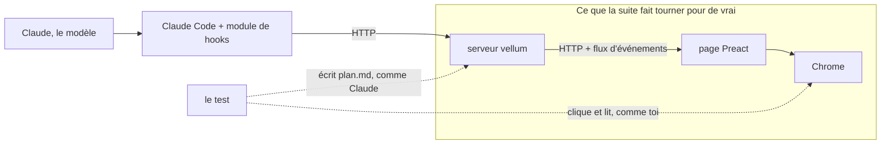

# Suite navigateur pour la page de vellum

Ferme l'issue #139. **Statut : reporté.** Une fois approuvé, ce plan est posté en commentaire sur l'issue #139 (`issue-139-comment.md`), et son implémentation attend que tu reprennes l'issue.

Documents à côté de ce plan :

- `pourquoi-issue-139.md` : le problème expliqué, avec les deux captures. À lire en premier.
- `capture-800px-aujourdhui.png`, `capture-800px-sans-readWindow.png` : la page à 800px de large, avec et sans la ligne `readWindow()`.
- `issue-139-comment.md` : le commentaire à poster sur l'issue, en anglais comme l'issue, avec les deux captures jointes.
- `grill-1.md` : la transcription du grill, mot pour mot (Q1 à Q8). Elle n'est pas postée : le dépôt est public, et le commentaire porte déjà ses décisions.
- Deux essais jetables, non gardés : Playwright sous `bun test`, et happy-dom avec le panneau `Comments`. Leurs mesures sont citées plus bas.
- Trois relectures du plan v3 par des architectes Opus : tests, distribution et CI, forme du plan. Ce que le plan en retient est dans « Ce que les relectures ont changé », en fin de plan.

## Le but, et ce qu'on y gagne

**Le but :** l'écran de la page est aujourd'hui vérifié à l'œil, par toi ou par un agent, après coup, une seule fois. Le but est qu'un test le vérifie avant chaque push, et pour toujours.

**Pourquoi :** depuis le premier commit de vellum, le 18 septembre, soit en 4 jours, 35 commits ont touché la page, dont 15 corrections. D'après leurs titres, environ la moitié corrigent un défaut visible seulement à l'écran : un liseré mal placé, Mermaid en clair sur une page sombre, un lien qui ouvre un onglet au lieu du plan, un bandeau d'erreur absent. Je ne les ai pas vérifiés un par un. Sur la PR #125, 14 défauts sont passés à travers toutes les gates.

**Ce que tu y gagnes, en tant qu'humain :**
1. **Moins de vérification à la main.** Un changement de la page ne demande plus que tu ouvres le navigateur pour chaque cas couvert : `bun test` le fait à chaque push.
2. **Une promesse tenue reste tenue.** Aujourd'hui, rien n'empêche un agent de casser une promesse de l'écran, par exemple « un panneau caché ne prend pas le focus ». Avec un test par promesse, il échoue avant d'arriver jusqu'à toi.
3. **Des PR plus simples à relire.** Tu lis un test qui dit ce que l'écran promet, au lieu de refaire le parcours toi-même.

**Ce que les agents y gagnent, en tant que futurs développeurs :**
1. **Une boucle de vérification sans humain.** Un agent qui modifie la page écrit un test, le voit échouer, corrige, puis le voit passer. Aujourd'hui, il ne peut que prendre des captures et les interpréter, ce qui ne se répète pas et n'entre dans aucune gate.
2. **Un filet contre les « nettoyages ».** `readWindow()` ressemble à une ligne inutile. Mesuré : un agent qui la supprime aujourd'hui passe toutes les gates. Après ce changement, `bun test` échoue.
3. **Un modèle à copier.** Le prochain test d'écran reprend `served()` et `screenAt()`, au lieu de réinventer le démarrage d'un serveur et d'un navigateur.

**Ce que ce plan seul ne donne pas :** il ne protège que le démarrage de la page. Le gain réel arrive avec l'issue de suivi, puis avec chaque futur changement de la page. Sans ces tests-là, le plan ne vaut pas son coût.

**Ce que ça coûte :**
1. `bun test` a besoin de `google-chrome` ou de `chromium` dans le `PATH`. Ta machine a `chromium`. D'après sa documentation, le runner GitHub a `google-chrome` ; la tranche 2 le vérifie.
2. Chaque installation du plugin télécharge 14 MB de plus, le paquet `playwright-core`. Aujourd'hui, `vellum/node_modules` pèse 225 MB. Aucun navigateur n'est téléchargé.
3. Environ 0,5 s de plus par test d'écran dans `bun test`, d'après l'essai.

### Ce que « test navigateur » veut dire ici

Ce n'est pas un test de bout en bout de vellum. Le test n'appelle jamais le modèle : il ne coûte aucune inférence. Il ne simule rien non plus entre la page et le serveur.



- **Réel :** le serveur, lancé par `startServer`, sur de vrais fichiers dans un répertoire temporaire. La page, compilée par Bun comme en session. Chrome, qui calcule les vraies tailles.
- **Remplacé par le test :** Claude et le module de hooks. Le test écrit lui-même `plan.md` dans le répertoire de travail, comme Claude le fait en session. Plus tard, pour un scénario comme « Claude soumet une v2 », le test appellera la même route HTTP que le module de hooks. Le helper `grilling()` de `extensions/grill/server.spec.ts` le fait déjà (`gate`, `approve`, `feedback`).
- **Remplacé par Playwright :** toi. Il ouvre la page, clique, et lit ce qui est affiché.

Les quatre couches de tests de vellum, une fois ce changement fait :

| Couche | Comment elle tourne | Appelle le modèle ? |
|---|---|---|
| Logique pure et état de la page (`*.spec.ts`) | `bun test`, les globales du navigateur simulées une par une | non |
| Module de hooks (`*.test.ts`) | `claude plugin test`, le moteur de Claude Code simulé par son kit de test | non |
| La page dans Chrome (**nouvelle**) | `bun test`, avec un vrai serveur, une vraie page et un vrai Chrome | non |
| Session réelle, de bout en bout | une session Claude Code avec `--plugin-dir vellum` (`docs/plugin-testing.md`), à la main | oui |

Seule la dernière couche relie tout, Claude compris. Elle reste manuelle, et ce changement n'y touche pas.

## Décisions

1. **Un test d'écran tient une promesse, pas un détail.** La page est en bêta, avec 35 commits en 4 jours. Un test qui vérifie une classe CSS (`folded`), une largeur exacte (310px) ou un débordement de 1px casserait à chaque refonte, même sans défaut pour l'utilisateur. Un agent tordrait alors le code pour garder vert un test devenu faux. Un test d'écran vérifie donc ce que l'utilisateur vit : « à 800px, rien ne recouvre le texte du plan ». Il porte le nom de cette promesse. S'il casse à cause d'un changement voulu, on le réécrit ou on le supprime. Le réglage visuel fin reste une vérification à l'œil tant que l'interface bouge.
2. **On couvre trois classes de défauts : le comportement, la géométrie, le démarrage.**
   - Le comportement : le focus et les changements d'état des composants qui utilisent des hooks.
   - La géométrie : ce qui recouvre quoi, ce qui est visible ou non.
   - Le démarrage : l'appel à `readWindow()` dans `app.tsx`, avant le premier affichage.

   Fait : parmi les six défauts nommés dans les commits de correction de la PR #125, quatre sont de la géométrie. Sans `readWindow()`, toutes les gates restent vertes (issue #139, commentaire sur la PR #149).
3. **On utilise Playwright seul, c'est-à-dire un vrai Chrome piloté depuis `bun test`.** Mesures de l'essai :
   - Deux tests, à 800px et à 1400px, passent en 1,44 s quand le cache est chaud.
   - Avec `readWindow()` en commentaire, le panneau s'ouvre à 800px sur 310px et recouvre le texte du plan (voir `capture-800px-sans-readWindow.png`). Le test de l'essai échoue.

   happy-dom est un faux navigateur en mémoire. Il a été mesuré, puis écarté :
   - Il ne voit aucune taille ni aucune position.
   - Chargé pour toutes les suites, comme le conseille Bun, il fait échouer 45 tests du serveur. Son `fetch` refuse les requêtes, et `Bun.serve` refuse son `Response`.
   - `freshStore` n'atteint pas l'état des composants, donc chaque suite devrait le remettre à zéro elle-même.
   - Un port que le test oublie de simuler ne fait plus planter le test : `matchMedia` répond `false` en silence.
4. **La dépendance vit dans `vellum/package.json`, sous `devDependencies`.** Raison : le plugin va devenir un dépôt à part. Faits :
   - Claude Code 2.1.278 lance `bun install --frozen-lockfile --ignore-scripts` dans le cache du plugin, sans `--production`. Les dépendances de dev s'installent donc chez chaque utilisateur.
   - Aucun navigateur n'est téléchargé, car le `package.json` de `playwright-core` n'a ni script ni dépendance.
   - Claude Code saute cette installation quand un `bunfig.toml` est à côté de `bun.lock` (message lu dans son binaire : « Skipped: a bunfig.toml beside the bun lockfile can load code at install time »). Ce changement ne crée donc aucun `vellum/bunfig.toml`.
5. **La suite navigateur est un `*.spec.ts` ordinaire.** Elle tourne avec `bun test`. Qui la lance :
   - Le `pre-push` et la CI la lancent. Le `pre-commit` ne la lance pas.
   - Le hook `stop-gates` ne la lance pas, car `scripts/run-gates.ts` ne contient pas `bun test`.
   - Les agents `issue-worker` la lancent dans leur worktree au `pre-push`. Sur ta machine, elle y passe.
   - Codex ne pousse jamais. Ce qu'il ferait dans son bac à sable n'est pas mesuré.

   Le prix : une machine sans navigateur dans le `PATH` fait échouer `bun test`.
6. **Ce changement livre la décision, la dépendance, la suite et deux tests** : l'écran au chargement, à 800px et à 1400px. L'issue de suivi ne garde que des promesses (voir Mécanique).
7. **Le renvoi à « l'échelle » quitte `vellum/AGENTS.md`.** Fait : `git log -S ladder -- AGENTS.md` ne renvoie rien. Le `AGENTS.md` racine n'en a jamais contenu.
8. **La suite s'appelle `vellum/src/core/page/browser.spec.ts`.** Les trois relecteurs ont fait ce choix. Les scénarios de suivi ne correspondent pas à un composant chacun : le composer qui suit son texte touche trois fichiers, et le thème des diagrammes vit dans `src/extensions/`. Dans `core/page/`, un `<source>.spec.ts` désigne déjà une suite sans DOM. Si la suite grossit, l'issue de suivi décidera du découpage.
9. **La suite cherche le navigateur elle-même, dans le `PATH`, au lieu d'utiliser `channel: "chrome"`.** Fait : sous Linux, `playwright-core` ne cherche `channel: "chrome"` qu'à `/opt/google/chrome/chrome`. Sur ta machine, ce chemin est un lien créé à la main vers `/usr/bin/chromium`, qu'aucun paquet ne possède (`pacman -Qo`). Chez un autre contributeur, Playwright échouerait, puis proposerait `npx playwright install chrome`. Cette commande lance le script apt de Google, et un agent bloqué par un pre-push rouge pourrait la lancer. La suite échoue donc avant Playwright, avec son propre message. Ce message nomme les binaires cherchés et dit d'installer un Chromium par le gestionnaire de paquets.

### Hypothèses prises à ta place

- **`playwright-core`, pas `playwright`.** Le paquet `playwright` ajoute sa ligne de commande et son propre lanceur de tests, que nous n'utilisons pas. Tailles mesurées : 14 MB pour `playwright-core`, 19 MB pour les deux. Non mesuré : l'essai a importé `playwright`. La tranche 1 le vérifie.
- **Les binaires cherchés, dans cet ordre :** `google-chrome`, `google-chrome-stable`, `chromium`, `chromium-browser`. Non couvert : macOS, où Chrome n'est pas dans le `PATH`. Ta machine est sous Linux. C'est l'hypothèse dont je suis le moins sûr, donc conteste-la si un contributeur est sous macOS.
- **Un serveur par test, un Chrome par fichier.** Chaque chargement de page écrit le brouillon (`PUT /api/draft`), et `gate` puis `approve` renomment le répertoire de travail. Un serveur partagé ferait passer ces états d'un test à l'autre. C'est le schéma de `grilling()`. Non mesuré : le coût de la compilation de la page, refaite à chaque serveur.
- **Le serveur démarre dans le processus du test, avec `startServer` et `port: 0`.** Non mesuré : qu'une page se compile dans le processus du test. Aucune suite ne le fait aujourd'hui. Si elle ne se compile pas, la tranche 1 lance `preview.ts` dans un processus à part, comme `standalone.spec.ts`, et lit l'URL sur la première ligne de sa sortie. L'écart est alors noté dans `implementation-notes.md`.
- **« Recouvert » se mesure par `document.elementFromPoint`**, au bout droit de chaque ligne du plan. Le point doit tomber dans le document, pas dans le panneau. **« Prend le focus »** se mesure en appelant `focus()` sur chaque bouton et chaque zone de texte du panneau, puis en lisant `document.activeElement`. Ces deux mesures ne dépendent ni d'une classe, ni d'une largeur.
- **Pas de nouvelle version du plugin.** Rien de ce qu'un utilisateur lance ne change.
- **Une branche et une PR :** `feature/vellum-browser-suite`, vers `dev`. Seule la CI prouve que Chrome est présent sur le runner, et une PR la lance avant que `dev` bouge.

## Interfaces

```ts
// vellum/src/core/page/browser.spec.ts
const BROWSERS = ["google-chrome", "google-chrome-stable", "chromium", "chromium-browser"] as const;
systemBrowser(): string                     // Bun.which over BROWSERS; throws naming them when none is found

beforeAll:  chromium.launch({ executablePath: systemBrowser() })   // from "playwright-core"
afterEach:  stop every server the test started
afterAll:   await browser?.close()

served(): Promise<Started>                  // startServer({ project: <tmpdir>, workdir, port: 0, watchdog: <expire throws> })

type Screen = {
  readonly planTextCovered: boolean         // a line end of the plan hits something outside the document
  readonly panelShown: boolean              // the comments panel takes room on screen
  readonly panelTakesFocus: boolean         // a control of the panel becomes document.activeElement
};
screenAt(started: Started, width: number): Promise<Screen>

test("at 800px the page loads with the plan's text uncovered and the comments out of the way")
  // expects { planTextCovered: false, panelShown: false, panelTakesFocus: false }
test("at 1400px the page loads with the comments beside the plan, reachable")
  // expects { planTextCovered: false, panelShown: true, panelTakesFocus: true }
```

```
bun test vellum      # needs google-chrome or chromium on PATH; without one, the suite fails naming the binaries it looked for
```

```diff
 vellum/package.json
   "dependencies": { … unchanged },
+  "devDependencies": { "playwright-core": "1.63.0" }
```

La trace de la décision, que demande le « Done when » de l'issue. Ce sont deux nouveaux points de `vellum/.claude/rules/tests.md`. Ils restent en anglais, comme le reste des règles :

```md
- The page's render is checked in a real browser, for three classes of defect: behaviour
  (focus, state), geometry (what covers what, what shows) and the boot of `app.tsx`.
  `core/page/browser.spec.ts` drives a Chrome or Chromium found on `PATH` through
  `playwright-core`, one server from `startServer` per test. A fake DOM was measured and
  refused: it sees no size or position, and happy-dom preloaded fails the server's suites.
  `bun test` needs that browser; install it with the system's package manager, never with the
  `playwright install` command Playwright prints.
- A screen test holds a promise the reviewer sees and is named after it ("at 800px nothing
  covers the plan's text"), never a class, a pixel width or a DOM shape. The page is in beta:
  a screen test that a deliberate change breaks is rewritten or deleted, never kept green by
  bending the code. Visual tuning, a pixel of overflow or a gutter, stays a check by eye.
```

## Fichiers

```diff
 AGENTS.md                          # the `bun test` line: vellum's browser suite needs google-chrome or chromium on PATH
 vellum/
~  package.json                     # devDependencies: playwright-core; description names the tests
~  bun.lock
+  src/core/page/browser.spec.ts    # Chrome through playwright-core, one startServer per test
~  .claude/rules/tests.md           # the two bullets above
~  .claude/rules/page.md            # "No suite runs app.tsx, so only a live page holds that call" is false now
~  .claude/rules/extensions.md      # the thin-adapter rule stays; its reason becomes: the DOM part is checked in browser.spec.ts
~  AGENTS.md                        # Boundaries: drop the ladder, package.json carries test deps too; Commands: bun test needs a browser on PATH
```

Sur GitHub :
- Un commentaire sur l'issue #139, maintenant : `issue-139-comment.md`, avec les deux captures.
- Plus tard, à l'implémentation : une issue de suivi, et une PR qui ferme #139.

## Tranches

0. **Le plan est posté sur l'issue.** Après ton approbation : `gh issue comment 139 --body-file issue-139-comment.md --attach` des deux captures.
   Contrôle : le commentaire est visible sur l'issue #139, avec les deux images.
1. **La suite tient le démarrage de la page.** Cette tranche ajoute la dépendance et la suite, avec ses deux tests. Les règles sont corrigées dans la même tranche, car la suite les rend fausses.
   Contrôle :
   - `bun test vellum/src/core/page/browser.spec.ts` passe.
   - Chaque test est vu en échec par une mutation, puis la mutation est retirée :
     - Avec `readWindow();` en commentaire dans `app.tsx`, le test à 800px échoue : le texte est recouvert, le panneau est visible et prend le focus.
     - Avec la requête de `readWindow` changée en `(min-width: 0px)`, le panneau se replie à toutes les largeurs, et le test à 1400px échoue.
   - Le message de commit dit « seen red by mutation » pour les deux tests.
   - `bun test` à la racine passe, comme le lancent le `pre-push` et la CI. `bun ./scripts/run-gates.ts` passe aussi, mais il ne contient pas `bun test`.
2. **La CI prouve que Chrome est présent sur le runner, et l'issue de suivi existe.**
   Contrôle :
   - Dans la CI de la PR, l'étape « Run test suites » est verte, et son journal montre que les deux tests de `browser.spec.ts` passent.
   - L'issue de suivi est ouverte, et la description de la PR la cite.

   Si la suite ne trouve aucun navigateur sur le runner, arrêter et rendre compte. Ne pas ajouter d'étape d'installation sans ton accord.

## Hors périmètre

Le réglage visuel fin (débordement de 1px, barre de défilement), happy-dom, le découpage des composants en vues pures, macOS, un audit des règles écrites par d'autres agents, et le déménagement de vellum dans son propre dépôt.

## Mécanique

- Installer avec `bun add --cwd vellum --dev --exact playwright-core@1.63.0`. Les dépendances existantes ont une version exacte.
- `served()` crée son projet avec `mkdtemp(join(tmpdir(), "vellum-browser-"))`, jamais sous `import.meta.dir` : l'essai y a laissé 20 répertoires. Il écrit `plans/<date>/wip-<8 hex>/plan.md` avec un plan de plusieurs lignes longues, pour qu'un panneau ouvert en recouvre forcément une. Il passe ensuite le répertoire par `parseWipDir`, comme `grilling()`. `afterEach` arrête chaque serveur, puis supprime son projet.
- Le `watchdog` est toujours passé. Celui par défaut appelle `process.exit(0)` après 90 s, ce qui terminerait `bun test` en vert. Son `expire` lève une erreur. Les serveurs sont arrêtés dans `afterEach`, indépendamment du navigateur. `afterAll` ferme ensuite le navigateur avec `browser?.close()`, car sans navigateur trouvé, `browser` n'est pas défini.
- `screenAt` ouvre une page avec `viewport: { width, height: 900 }` et `reducedMotion: "reduce"`, puis va sur `started.url`. `style.css` coupe les transitions sous `prefers-reduced-motion: reduce`, donc rien ne bouge pendant la mesure. Il attend que le texte du plan soit affiché, puis attend `document.fonts.ready`. Il fait ensuite les trois mesures dans un seul `evaluate`, puis ferme la page.
- Ne jamais attendre `networkidle` : le flux d'événements de la page ne s'arrête jamais.
- `page.setDefaultTimeout(2_000)`, sous les 5 s par test de `bun test`. Un échec nomme alors le sélecteur, au lieu d'un dépassement de temps sans détail. Un délai plus long se règle dans le code (`setDefaultTimeout` de `bun:test`), jamais dans un `vellum/bunfig.toml`.
- Écrire l'issue de suivi avec `github-flow:issue`. Elle ne garde que des promesses, une par ligne :
  - Replié par sa poignée, le panneau ne laisse aucun contrôle prendre le focus au clavier.
  - Un composer ouvert reste à côté du texte qu'il cite quand un repli élargit le document.
  - Avec un système en thème sombre, un diagramme Mermaid et une maquette HTML suivent le thème de la page.

## Ce que les relectures ont changé

Retenu, et vérifié dans le code avant d'être retenu :
- **Le watchdog par défaut appelle `process.exit(0)`** (`serve.ts`, `WATCHDOG`). Le plan le passe donc toujours, avec un `expire` qui lève une erreur.
- **Un serveur par test**, pour qu'aucun brouillon ni renommage ne passe d'un test à l'autre.
- **`channel: "chrome"` n'est valable que grâce à ton lien fait à la main.** La suite cherche donc le navigateur dans le `PATH` (décision 9).
- **Le test à 1400px n'était jamais vu en échec.** Une seconde mutation le fait échouer.
- **`run-gates.ts` ne lance pas `bun test`.** La tranche 1 lance donc `bun test` à la racine.
- **Pas de navigateur téléchargé, pour la bonne raison.** `playwright-core` n'a aucun script d'installation ; `--ignore-scripts` n'y est pour rien.
- **Un `bunfig.toml` à côté de `bun.lock` bloque l'installation chez l'utilisateur.**
- **Stabilité des mesures :** les animations sont réduites, la suite attend le chargement des polices, et Playwright a son propre délai d'attente.
- **Le `AGENTS.md` racine** signale que `bun test` a besoin d'un navigateur. **La règle « adaptateur mince »** garde une raison vraie.

Écarté :
- **Garder les barres de défilement visibles** (`--hide-scrollbars`). Seul le scénario de la barre de défilement en avait besoin, et il est retiré du suivi (décision 1).
- **Passer la suite par `--path-ignore-patterns`.** Aucune décision ne demande de la sauter.
- **Nommer les futurs fichiers `*.browser.spec.ts` ou `core/page/browser/`.** Ce choix revient à l'issue de suivi, quand un second fichier existera.
