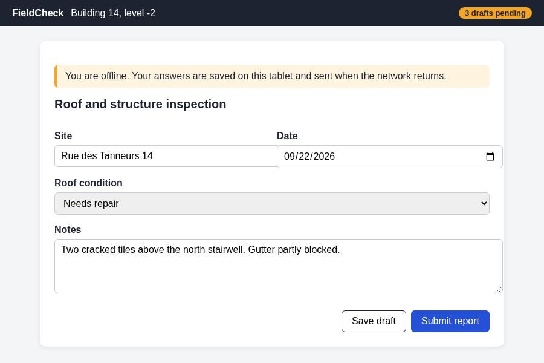

# Edge cases for the reader

The capture, addressed from the project root so the page can load it: 

The same capture, addressed from the plan's directory: 

#### A fourth-level heading

A paragraph under a fourth-level heading.

##### A fifth-level heading

A paragraph under a fifth-level heading.

## A wide table

| Step | Command | Before | After | Owner | Risk | Rollback | Note |
|---|---|---|---|---|---|---|---|
| 1 | `git rebase --onto origin/dev feature/offline-sync-conflict-review~3 feature/offline-sync-conflict-review` | three commits on `main` | a linear history | platform | medium | `git reflog` then `git reset --hard HEAD@{1}` | run it on a clean tree only |
| 2 | `git push --force-with-lease origin feature/offline-sync-conflict-review` | the remote is behind | the remote matches | platform | low | push the old head again | a lease refuses a push someone else moved |

## A diagram that fails to parse

```mermaid
flowchart LR
  A[Field blur] --> B{Online?
  B -- yes --> C[Replay now]
```

## Nested quotes and tasks

> A quote.
>
> > A quote inside the quote.

- [x] Done at the top level
  - [ ] Pending, nested
