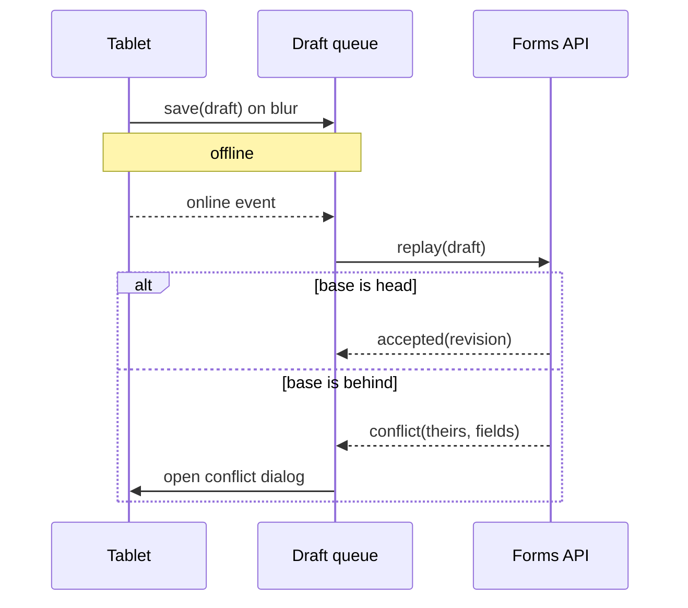
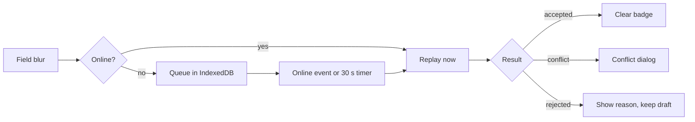

# Offline sync for the field inspection app, with conflict review before merge

The inspectors lose the network in basements and on rooftops. Today a form filled offline is lost when the tab closes. This plan keeps every draft in IndexedDB, replays it when the network returns, and asks the inspector to settle a conflict instead of overwriting the office's edit.

See the mockup in [mockup.html](mockup.html), the conflict screen in `screens/conflict-dialog.html`, and the current capture in . The research notes are in [research-notes.md](research-notes.md). The engine it builds on is described in `vellum/README.md` and `vellum/docs/architecture.md`, and the testing facts in `docs/plugin-testing.md`.

## Decisions

| # | Decision | Chosen | Rejected | Why |
|---|---|---|---|---|
| D1 | Where drafts live | IndexedDB, one store per form | `localStorage` | 5 MB cap, synchronous, strings only |
| D2 | Who wins a conflict | The inspector decides, field by field | Last write wins | An office correction must never vanish silently |
| D3 | When to replay | On `online` event and every 30 s while pending | Only on page load | Inspectors keep the tab open for a whole shift |
| D4 | Attachment upload | Chunked, 512 KiB, resumable with `Content-Range` | Single `PUT` | A 40 MB photo set fails on a flaky 3G link and restarts from zero |

> Open question: do we keep a draft once the server accepted it? Keeping it costs storage; dropping it loses the audit trail the quality team asked for in March.

## Interfaces

```ts
export type Draft = {
  readonly id: DraftId;
  readonly formId: FormId;
  readonly fields: ReadonlyMap<FieldName, FieldValue>;
  readonly base: Revision; // the server revision the inspector started from
  readonly savedAt: Date;
};

export type ReplayResult =
  | { readonly kind: "accepted"; readonly revision: Revision }
  | { readonly kind: "conflict"; readonly theirs: Revision; readonly fields: readonly FieldName[] }
  | { readonly kind: "rejected"; readonly reason: string };

export function replay(draft: Draft, api: FormsApi): Promise<ReplayResult>;
```

The CLI the support team runs to inspect a device's queue:

```bash
inspect-sync queue --device 7f3a --since 2026-09-01 --format json | jq '.[] | select(.state == "conflict")'
```

## Files

```text
src/
├── sync/
│   ├── drafts.ts          new: the IndexedDB store, one object store per form
│   ├── replay.ts          new: replay(), the conflict detection against `base`
│   └── upload.ts          new: chunked, resumable attachment upload
├── forms/
│   ├── form-page.tsx      changed: saves on every field blur, shows the pending badge
│   └── conflict.tsx       new: the field-by-field conflict dialog
└── app.tsx                changed: registers the `online` listener and the 30 s timer
```

## Slices

1. **Drafts survive a closed tab.** Save on blur, restore on load.
   - Check: fill three fields offline, close the tab, reopen: the three values are there.
   - Check: a second form's draft does not leak into the first.
2. **Replay without conflict.** A draft whose `base` is still the server's head is accepted.
   - Check: go offline, edit, go online: the pending badge clears within 30 s and the office sees the edit.
3. **Conflict dialog.** A draft whose `base` is behind opens the dialog, one row per conflicting field.
   - Check: edit field *Roof condition* in the office and on the tablet; the tablet shows both values and keeps neither until the inspector picks.
   - Nested detail: the dialog lists the office author and the time of their edit, so the inspector knows whom to call.
4. **Resumable attachments.**
   - Check: throttle to 3G, upload 40 MB, cut the network at 50 %: the upload resumes at the last acknowledged chunk.

- [x] D1 agreed with the platform team
- [ ] D4 needs the storage team's answer on `Content-Range` support

## Flow





### A very long identifier that should wrap or scroll

The migration touches `sync.inspectionFormDraftQueue.pendingAttachmentUploadChunkAcknowledgementsByDeviceIdentifier` and the endpoint https://forms.example.internal/api/v3/organisations/field-operations/inspection-forms/drafts/replay?include=attachments,history,conflicts&device=7f3a9c21.

---

## Out of scope

Push notifications for a conflict, a merge UI on the office side, and any change to the forms schema.

## Mechanics

The timer uses `setInterval` guarded by `document.visibilityState`, so a background tab on a locked tablet does not drain the battery. IndexedDB writes go through a single transaction per blur; a failed write shows the error inline under the field and keeps the value in memory until the next blur.
